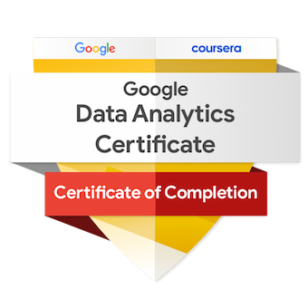
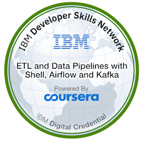
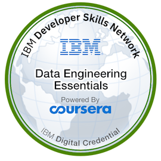

# Abhishek Dixit  

**`Machine Learning, Software Development & all things Data`**

"The goal is to turn data into information, and information into insight." - Carly Fiorina

ML - Deep Learning - Data Science projects <a href="https://abhishek-dxt.github.io/" target="_blank">here</a>

GCP - Apache Hive - Big Data Project <a href="https://github.com/Abhishek-Dxt/GCP_ApacheHive_BigData">here</a> 

AWS - Azure Data Engineering Pipeline <a href="https://github.com/Abhishek-Dxt/AWS_S3_to_Azure_Datalake_to_Azure_SQLdb_Pipeline_Data_Engineering">here</a>

GCP Pipeline using Dataflow, BigQuery and Looker Studio <a href="https://github.com/Abhishek-Dxt/GCP_Dataflow_BigQuery_Looker">here</a> 

GCP vs. Google Colab Data Cleaning  

PySpark Data Transformation - 2 ways (GCP Dataproc Cluster vs Google Colab) Project 

Data Engineering project: Real-time streaming pipeline using Airflow and Kafka <a href="https://github.com/Abhishek-Dxt/ETL_Airflow_Kafka">here</a>

NLP Project <a href="https://abhishek-dxt-nlp-data-roles-app-462v2a.streamlit.app/">here</a>

GCP - BigQuery for Machine Learning Project <a href="https://github.com/Abhishek-Dxt/BigQuery_ML">here</a>

RoBERTa & Hugging Face Transformer for Sentiment Analysis & Grammar Correction <a href="https://github.com/Abhishek-Dxt/Transformers_Sentiment_Analysis_Grammar_Correction">here</a>

Tableau Projects <a href="https://public.tableau.com/app/profile/abhishek.dixit2101">here</a>

PySpark ETL Pipeline: Hive to Postgres on Local IDE (PyCharm) <a href="https://github.com/Abhishek-Dxt/PySpark_Hive_Postgres_ETL_Pipeline">here</a>

Car Bazaar <a href="https://abhishek-dxt-car-bazaar-app-oiosn0.streamlit.app/">here</a>

# Specializations & Certifications

